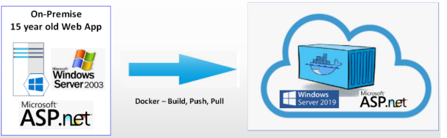

- Author Nigel Wardle. Node4

  

# Audience
Developers, Solution Architects

### Look up this course!!! https://www.udemy.com/course/docker4dotnet/

# Migrating Applications into Docker images
The purpose of this training course is to remove the magic associated with containerising an application, running and deploying to a container registry.
This course shows how to containerise:

- Ubuntu
- PHP
- Python
- Go
- NodeJS
- Java
- ASP.NET Core (Linux)
- Legacy ASP.NET Webforms (Windows)

## Prerequisites

1. Gain admin rights to your laptop
2. Download and install VS Code onto your laptop  https://code.visualstudio.com/download
3. Download and install Docker Desktop onto your laptop https://docs.docker.com/desktop/windows/install/ 

A possible rebot may be beneficial.  

## Check your Prerequisites

6. Run VS Code and open a new BASH terminal
7. enter: *git version*  
8. enter  *docker version* 
9. Double click on fve.reg  

A possible rebot may be beneficial. 

## Clone repo code to laptop folder 
10. create a new folder e.g: c:\docker
11. using Windows Explorer navigate to this above or chosen folder
12. either, right click for a Bash Git command and paste in: *git clone https://github.com/n4demo/learn-to-containerise*
13. or, download the zip file, extract and copy to your above folder

## (Optional) to save download time in lab
14. To download base images\layers (on wifi) to speed things up when building Docker images, open a terminal in VS Code or command prompt and run:

```
docker pull ubuntu  
docker pull python  
docker pull python:3.6  
docker pull python:3.6-alpine  
docker pull php:apache  
docker pull mcr.microsoft.com/dotnet/core/aspnet:3.0-buster-slim  
docker pull mcr.microsoft.com/dotnet/core/sdk:3.0-buster  
docker pull mcr.microsoft.com/dotnet/framework/sdk:4.8
docker pull mcr.microsoft.com/dotnet/framework/aspnet:4.8  
docker pull node:12
docker pull java:8
docker pull golang:1.12-alpine
```

## Start lab
15. In VS Code File...Open Folder.. c:\docker\docker-root\docker-apps\linux\ubuntu


